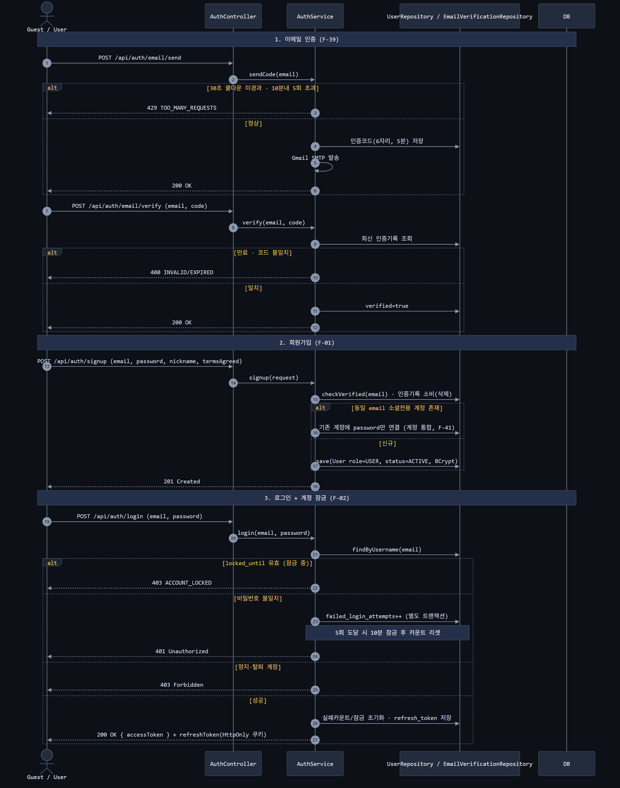
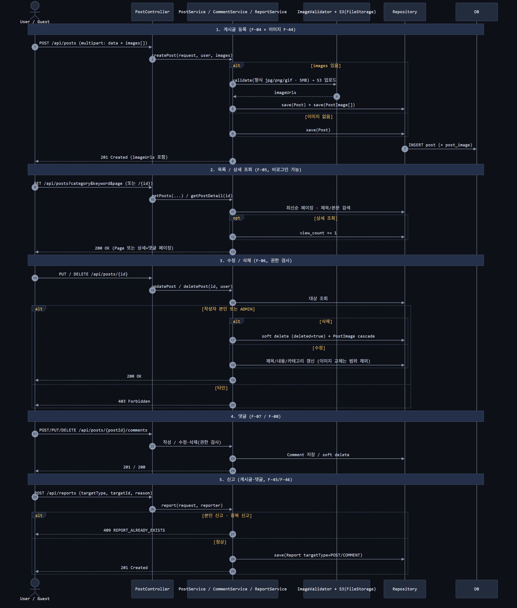
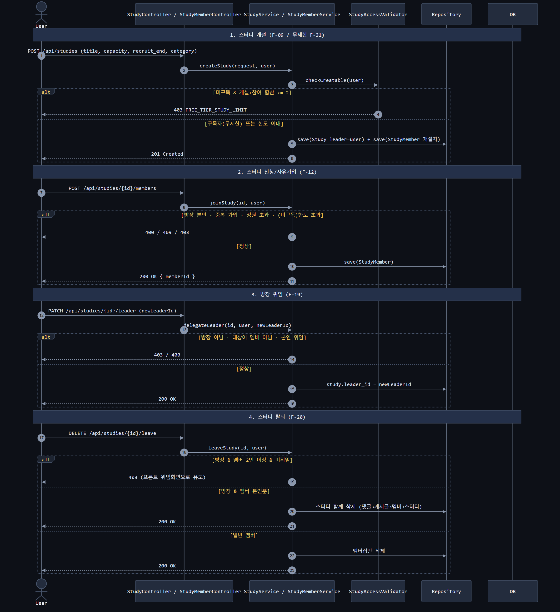
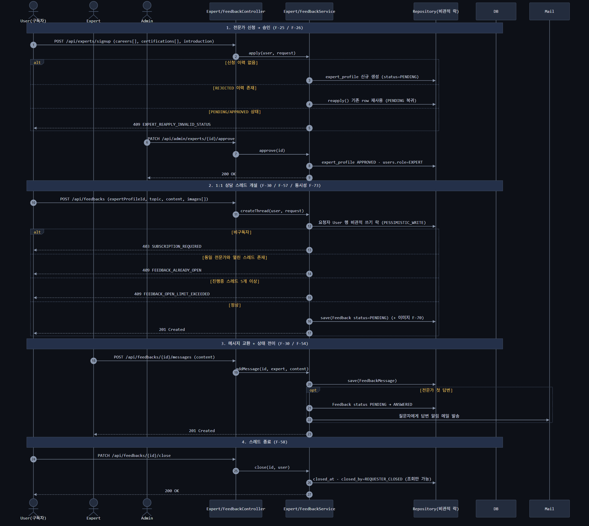
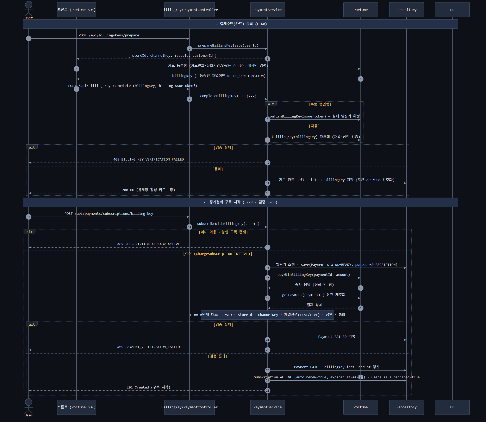
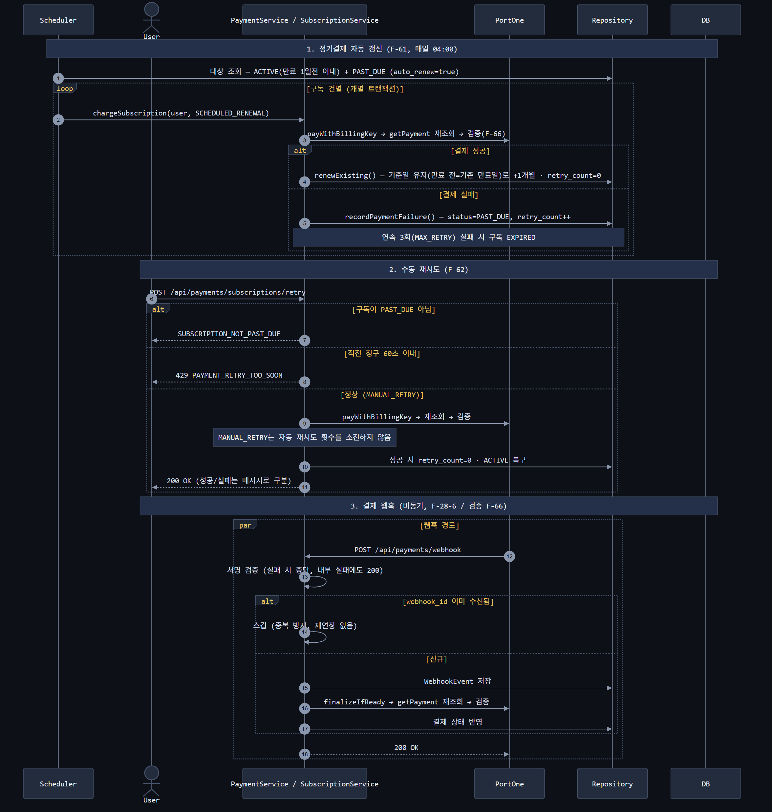
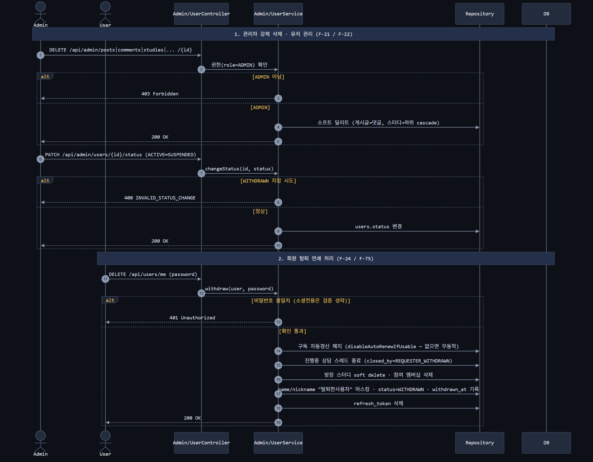

# 시퀀스 다이어그램

### 1. 인증·계정 (F-01·F-02·F-39·F-41)

### 2. 게시판 (F-04F-08·F-44F-46)

### 3. 스터디 (F-09·F-12·F-19·F-20·F-31)

### 4. 전문가·상담 (F-25·F-26·F-30·F-57·F-58·F-73)

### 5. 결제① 카드 등록·구독 시작 (F-60·F-28·F-66)

### 6. 결제② 자동갱신·재시도·웹훅 (F-61·F-62·F-28-6)

### 7. 관리자·회원탈퇴 (F-21·F-22·F-24·F-75)

