# 사용자흐름

# 사용자 흐름

---

**Happy path**

| 흐름 | F-ID | 목적 |
| --- | --- | --- |
| UF-01 | F-05, F-10, F-30 | 비로그인 둘러보기 (메인 QnA/전문가게시판/스터디 3분할) |
| UF-02 | F-01, F-02, F-03, F-04, F-07 | 가입·로그인(JWT/소셜)·게시글 작성·댓글 |
| UF-03 | F-05, F-06, F-07, F-08 | 게시글 목록/상세 → 수정·삭제, 댓글 수정·삭제 |
| UF-04 | F-09, F-11, F-19, F-20 | 스터디 개설 → 수정·삭제(방장/ADMIN, 위임·인원1명 조건) |
| UF-05 | F-10, F-12, F-18, F-31 | 스터디 신청 → 가입 → 그룹 유저관리 (끝에서 게시판) |
| UF-06 | F-21, F-22, F-26, F-27 | 관리자 - 게시판/스터디/유저관리 + 전문가 승인 |
| UF-07 | F-25, F-26 | 전문가 회원가입 → PENDING → 승인 → 활성화 |
| UF-08 | F-28, F-60, F-66 | 카드 등록 → 첫 달 즉시 결제(PG 재조회 검증) → ACTIVE |
| UF-09 | F-30 | 구독자 → 전문가 게시판 질문 → EXPERT 답변 |
| UF-10 | F-24, F-33, F-34, F-64 | 마이페이지 → 닉네임 수정·비밀번호 변경·결제수단 관리·회원 탈퇴 |
| **UF-11** | F-13, F-14, F-15, F-16, F-17 | 스터디 게시판 - 글 작성/목록/상세/수정·삭제/댓글 (가입자 전용) |
| **UF-12** | F-62 | 정기결제 실패 → PAST_DUE → 자동 재시도(3회)/수동 재시도 → 복구 또는 종료 |
| **UF-13** | F-28, F-63 | 구독 해지(자동 갱신 예약 취소) → 만료 전 재개 |
| **UF-14** | F-60, F-64, F-65 | 결제수단 등록·변경·삭제 (마이페이지 설정) |
| **UF-15** | F-68 | 결제 웹훅 수신 → 서명 검증 → 재조회로 결제 상태 동기화 (시스템 흐름) |

**Exception path**

| 흐름 | F-ID | 목적 |
| --- | --- | --- |
| UF-X01 | F-04, F-06, F-07, F-08, F-09, F-11, F-13, F-15, F-17 | 비로그인 작성 거부 + 타인 수정·삭제 403 (Q&A+스터디+스터디게시판 공통) |
| UF-X02 | F-12, F-20 | 스터디 신청 가능여부 + 방장 미위임 탈퇴 시도 403 |
| UF-X03 | F-01, F-02, F-03, F-13, F-21, F-22, F-23 | 인증/권한/입력검증 공통 예외 |
| **UF-X04** | F-30, F-59 | 비구독자/구독만료자 전문가 상담 요청 거부 (개설·메시지 작성 시 차단, 조회는 허용) |
| **UF-X05** | F-63, F-66 | 카드 없이 재개·재결제 시도 차단(404), 중복 결제 방지(재조회 검증·완료 API 멱등) |

---

- UF-01. 비로그인 둘러보기 (메인 QnA/전문가게시판/스터디 3분할)
    
    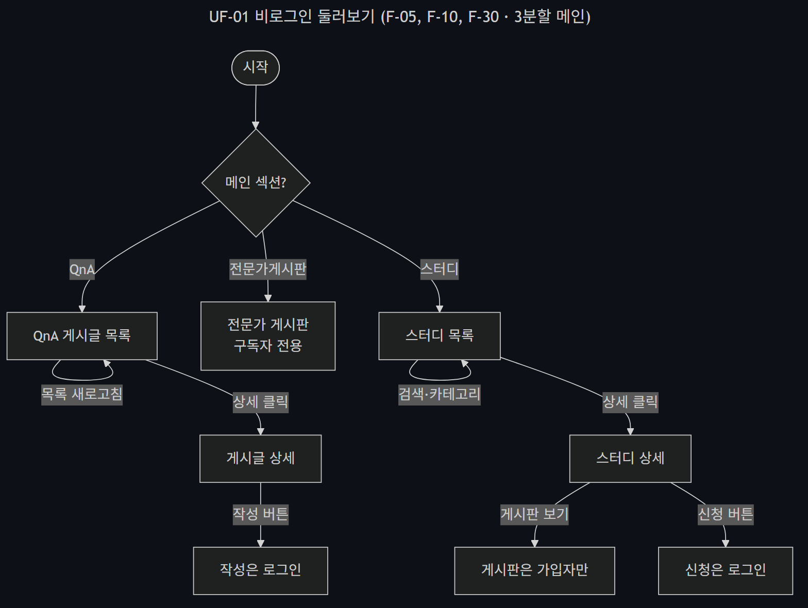
    
    UF-01
    
- UF-02. 가입·로그인(JWT/소셜)·게시글 작성·댓글
    
    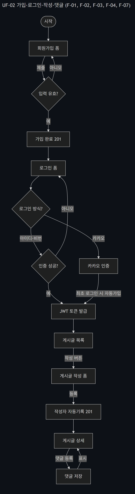
    
    UF-02
    
- UF-03. 게시글 목록/상세 → 수정·삭제, 댓글 수정·삭제
    
    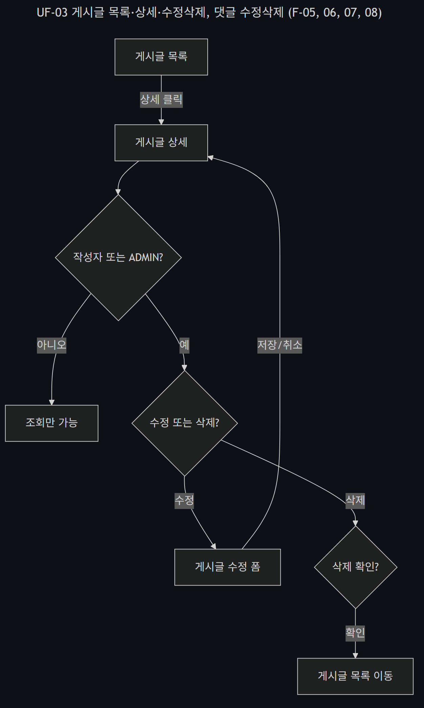
    
    UF-03
    
- UF-04. 스터디 개설 → 수정·삭제 (방장/ADMIN, 위임·인원1명 조건)
    
    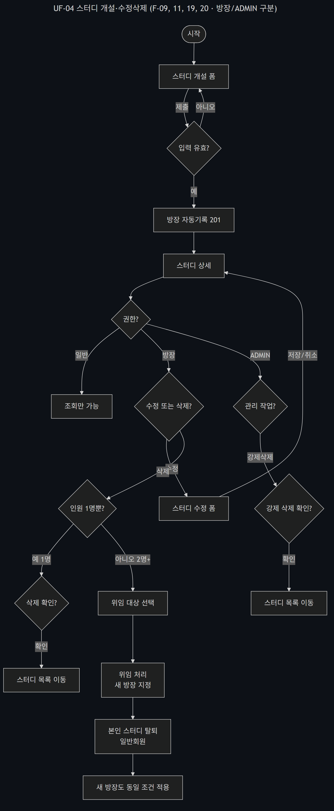
    
    UF-04
    
- UF-05. 스터디 신청 → 가입 → 그룹 유저관리
    
    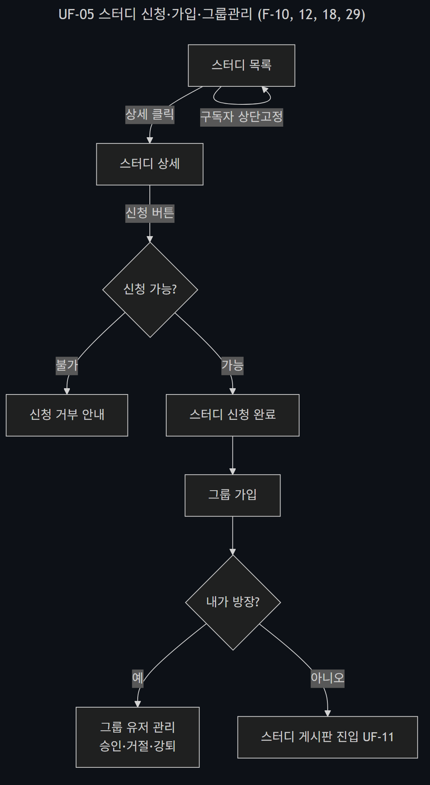
    
    UF-05
    
- UF-06. 관리자 - 게시판/스터디/유저관리 + 전문가 승인
    
    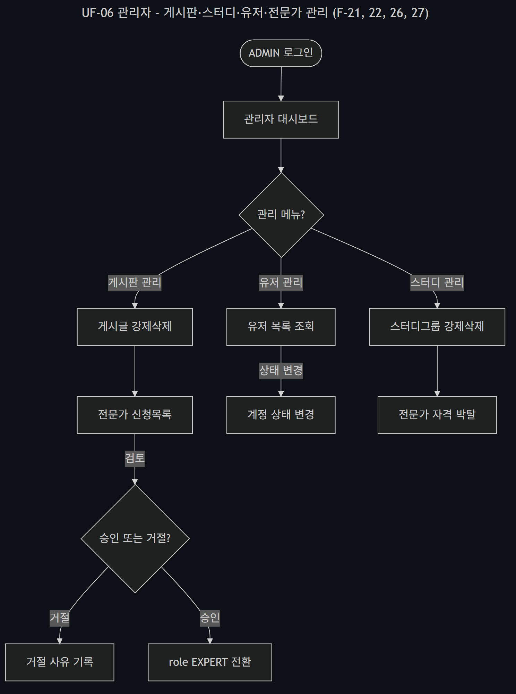
    
    UF-06
    
- UF-07. 전문가 회원가입 → PENDING → 승인 → 활성화
    
    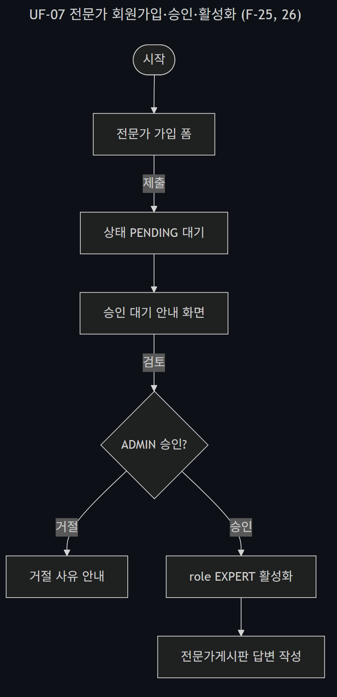
    
    UF-07
    
- UF-08. 카드 등록 → 첫 달 즉시 결제 → ACTIVE
    
    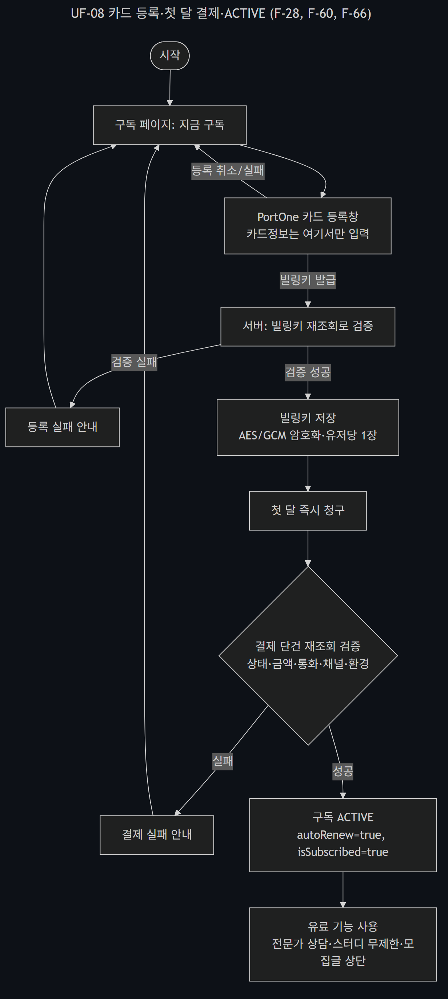
    
    UF-08
    
- UF-09. 구독자 → 전문가 게시판 질문 → EXPERT 답변
    
    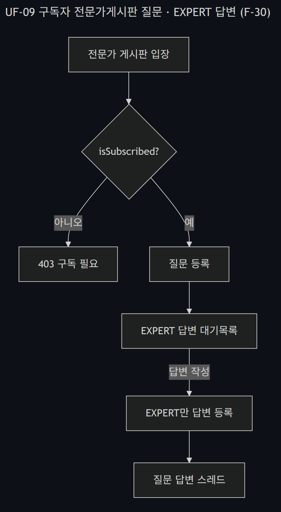
    
    UF-09
    
- UF-10. 마이페이지 설정 → 닉네임·비밀번호·결제수단·회원 탈퇴
    
    > 설정 탭에 “결제수단 관리”(F-64)가 추가되었습니다. 카드 등록/변경/삭제 상세 흐름은 UF-14 참고.
    회원 탈퇴는 방장이어도 가능하며, 방장인 스터디는 소프트 삭제됩니다(기존 “방장이면 탈퇴 불가”는 코드와 달라 바로잡음). 탈퇴 계정의 작성글은 “탈퇴한 사용자”로 표기됩니다(F-43).
    > 
    
    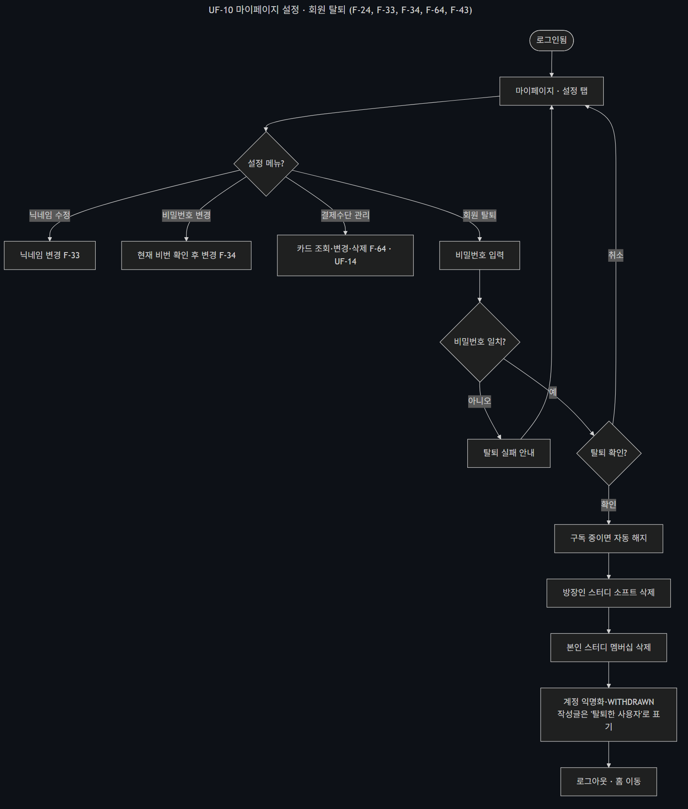
    
    UF-10
    
- UF-11. 스터디 게시판 - 글 작성/목록/상세/수정·삭제/댓글 (가입자 전용
    
    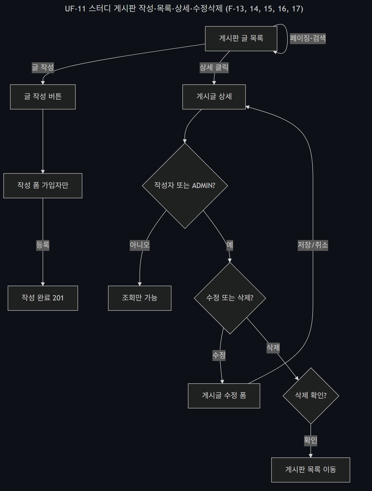
    
    UF-11
    
- UF-12. 정기결제 실패 → 유예 → 재시도 → 복구 또는 종료
    
    > 결제가 실패해도 이미 결제된 기간까지는 그대로 이용합니다. 그 기간이 끝나면 유료 기능이 막히고(상태는 PAST_DUE 유지), 하루 1회 자동 재시도가 이어집니다. 자동 재시도 3회를 모두 실패하면 구독이 종료됩니다. 사용자는 언제든 즉시 재결제할 수 있고, 성공하면 바로 복구됩니다.
    > 
    
    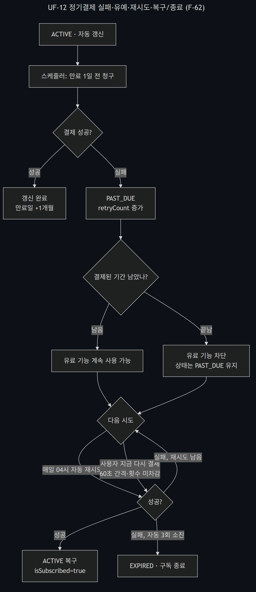
    
    UF-12
    
- UF-13. 구독 해지(자동 갱신 예약 취소) → 재개
    
    > 해지는 즉시 종료가 아니라 “다음 회차 자동 결제만 중단”입니다(autoRenew=false). 만료일까지는 계속 이용하고, 만료 전이면 다시 켤 수 있습니다.
    > 
    
    UF-13
    
    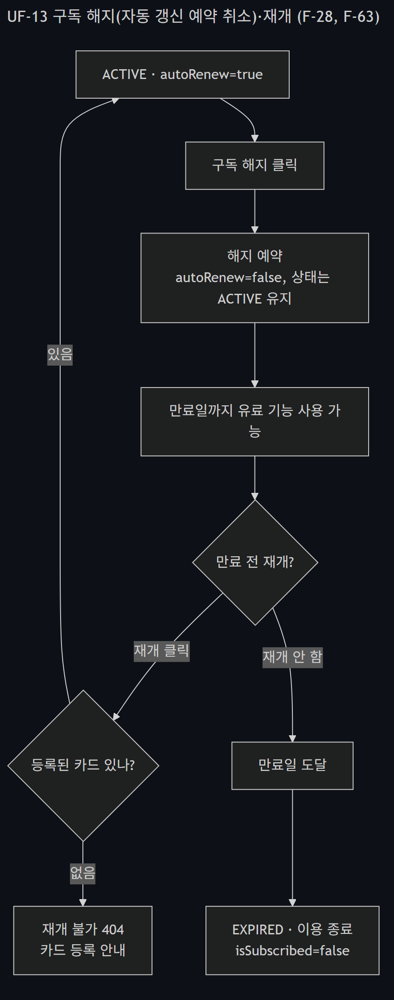
    
    UF-13
    
- UF-14. 결제수단 등록·변경·삭제 (마이페이지 설정)
    
    > 카드번호·유효기간·CVC는 서버에 저장하지 않고 PortOne이 발급한 빌링키만 보관합니다(암호화). 유저당 카드 1장이라 새로 등록하면 기존 카드는 교체됩니다. 삭제하면 PortOne과 서버 양쪽에서 빌링키를 폐기하고, 구독 중이면 자동 갱신도 함께 해지됩니다. 90일간 청구에 쓰이지 않은 카드는 자동 정리됩니다(F-65).
    > 
    
    UF-14
    
    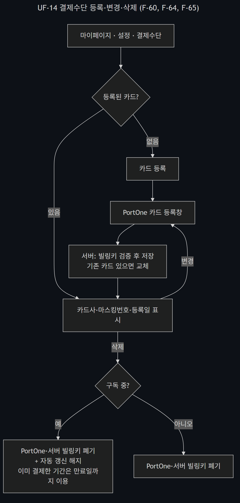
    
    UF-14
    
- UF-15. 결제 웹훅 수신 → 상태 동기화 (시스템 흐름)
    
    > PortOne이 결제 상태 변화를 웹훅으로 알려줍니다. 서명(webhook-id·signature·timestamp)을 검증하고 webhook-id로 중복을 거른 뒤, 결제 단건을 재조회해(완료 API와 동일한 검증) 상태를 반영합니다. PG 콘솔 취소·카드사 사후 취소·청구 타임아웃 결과 미확인 건을 잡아냅니다. 청구 트리거는 스케줄러 그대로이며(예약 API 미사용), 웹훅은 상태 동기화 용도입니다.
    > 
    
    UF-15
    
    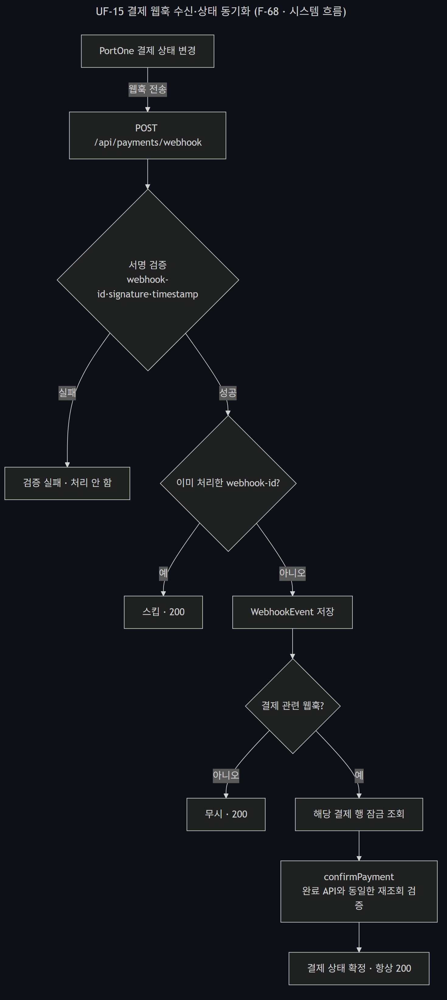
    
    UF-15
    
- UF-X01. 비로그인 작성 거부 + 타인 수정·삭제 403
    
    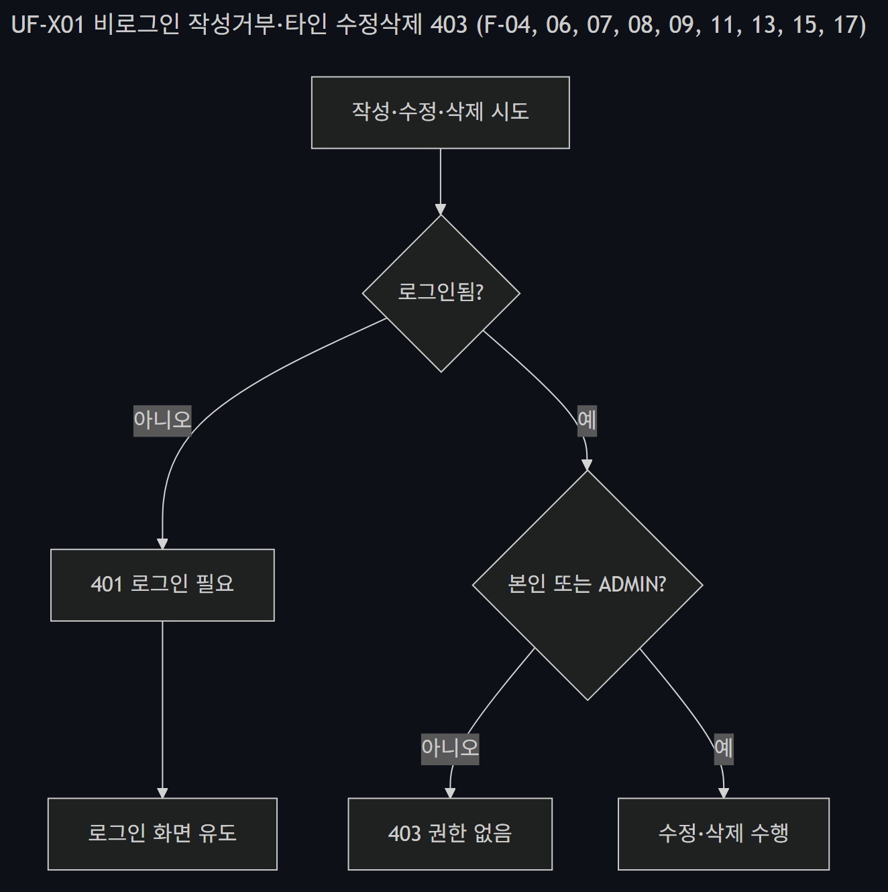
    
    UF-X01
    
- UF-X02. 스터디 신청 가능여부 + 방장 미위임 탈퇴 시도 403
    
    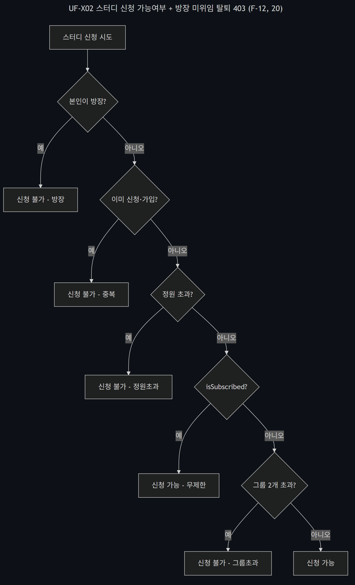
    
    UF-X02
    
- UF-X03. 인증/권한/입력검증 공통 예외 (401·403·400·토큰만료)
    
    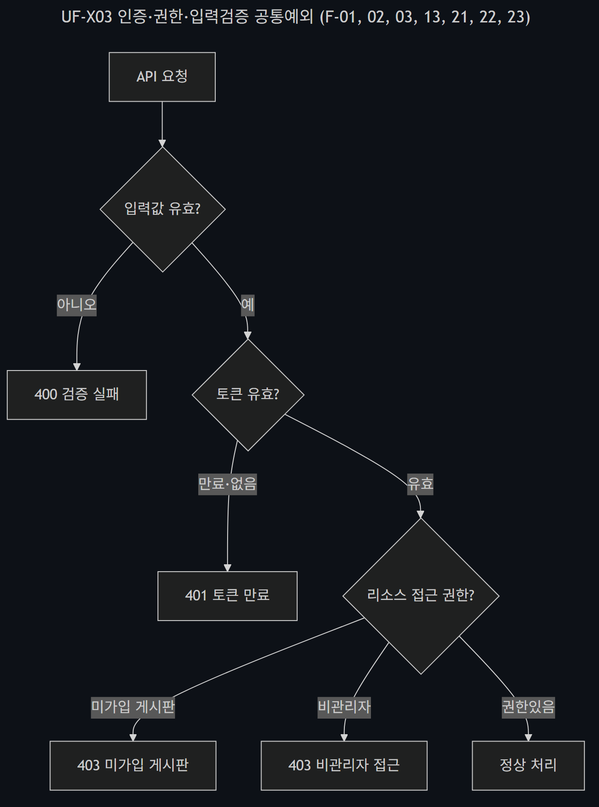
    
    UF-X03
    
- UF-X04. 비구독자/구독만료자 전문가 상담 요청 거부
    
    > 구독이 없거나 만료된 사용자는 전문가 상담 스레드 개설과 메시지 작성이 막힙니다(403/409). 단, 기존 스레드 조회는 계속 허용됩니다. 재구독(또는 재결제 성공)하면 자동으로 복구됩니다.
    > 
    
    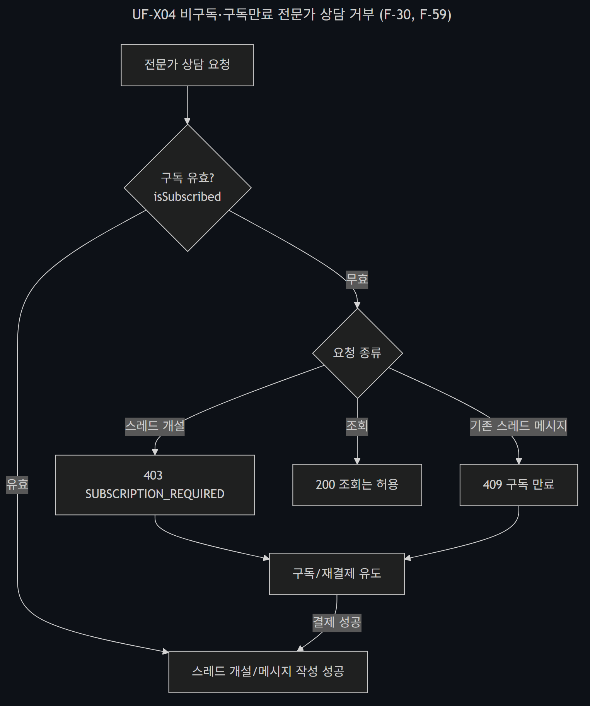
    
    UF-X04
    
- UF-X05. 카드 없이 재개·재결제 시도 차단 / 중복 결제 방지
    
    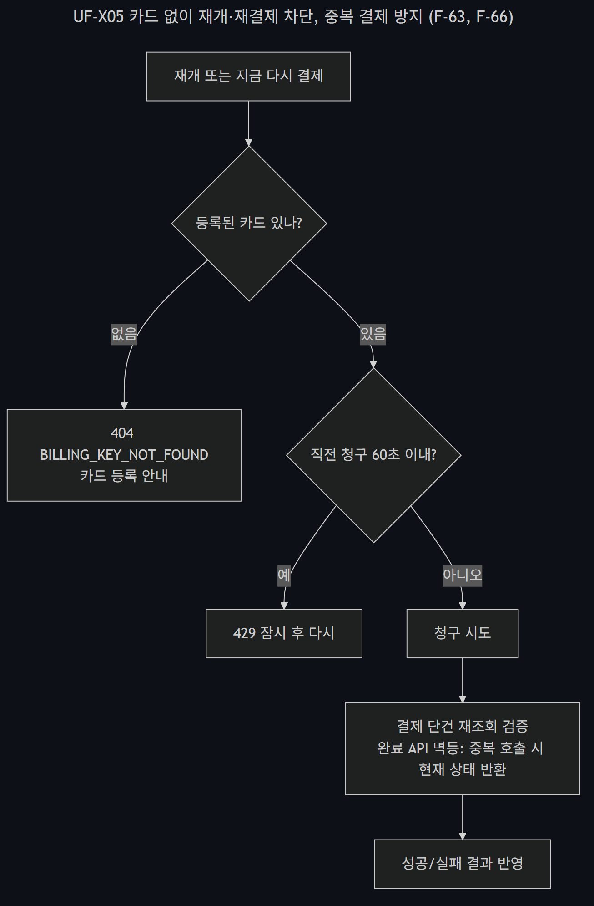
    
    UF-X05